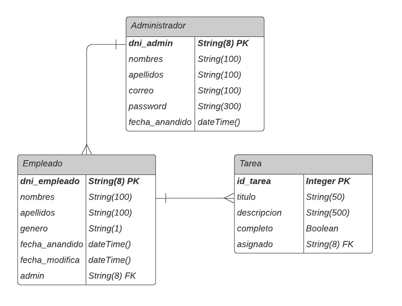

## Nombre del proyecto: **Sistema de administración de empleados y tareas TAMBO**

## Integrantes:

| Código    | Nombres y Apellidos         | Correo Institucional                                          |
| --------- | --------------------------- | ------------------------------------------------------------- |
| 202110216 | Luis Fernando Méndez Lázaro | [luis.mendez.l@utec.edu.pe](mailto:luis.mendez.l@utec.edu.pe) |
| 202110394 | Jose Francisco Wong Orrillo | [jose.wong@utec.edu.pe](mailto:jose.wong@utec.edu.pe) |
| 202110399 | Jean Franco Aquino Rojas | [jean.aquino@utec.udu.pe](mailto:jean.aquino@utec.udu.pe) |
## Descripción:

Hoy en día, muchas empresas están buscando herramientas que mejoren la productividad de su personal administrativo y empleados. Es por ello, que se requiere de software que organice sus recursos y se ajuste a sus necesidades. En ese marco, nace este proyecto que pretende solucionar estos problemas en aquellas organizaciones que buscan máxima eficiencia. Entre estas se encuentra la cadena de tiendas Tambo+, siendo nuestro proyecto a quien va dirigido.


## Objetivos principales / Misión / Visión:

### Misión

- Resolver problemas de gestión de empleados y asignación de tareas
que posee la cadena de tiendas Tambo, por medio de una plataforma web.

### Visión

- Convertirse en una plataforma reconocida por su escalabilidad y gran solvencia al aumentar la productividad del personal administrativo.

### Objetivos

- Otorgar flexibilidad y eficiencia para organizar empleados.
- Proveer un servicio personalizado y herramientas de gestión a administradores.

## Librerías / frameworks / plugins utilizados en el Front-end, Back-end y Base de datos:

### Front-end:

Para el front-end se utilizaron las siguientes tecnologías:

- VUE.js
- VUE CLI


### Back-end:

Para el back-end se utilizaron las siguientes tecnologías:

- flask
- SQLalchemy
- jwt (para generar tokens y autenticar usuarios)
- werkzeug.security (encriptación de contraseñas)

### Base de datos:

- PostgreSQL (servidor alojado en la plataforma Heroku)

## Nombre del Script a ejecutar para iniciar la base de datos con datos:

Dado que la base de datos y su respectivo servidor se encuentran alojadas en Heroku (programa en la nube) no se requiere de un script para ser inicilializados.

## Información acerca de los API. Requests y Responses de cada endpoint utilizado en el sistema:

| HTTP method | API endpoint                      | Description and response                                    |
| ----------- | --------------------------------- | ----------------------------------------------------------- |
| GET         | /empleados                        | Obtener la lista de empleados y sus atributos               |
| GET         | /tareas                           | Obtener la lista de tareas y sus atributos                  |
| POST        | /register/register\_admin         | Crea y registra a un administrador en la base de datos      |
| POST        | /login/log\_admin                 | Autenticación e inicio de sesión de los administradores     |
| POST        | /empleados/new\_empleado          | Crea y registra a un empleado en la base de datos           |
| DELETE      | /empleados/delete\_empleado/< dni > | Elimina a un empleado de la base de datos apartir de su dni |
| PATCH       | /empleados/update\_empleado/< dni > | Actualiza los datos de un empleado apartir de su dni        |
| POST        | /empleados/asignar\_tarea/< dni > | Asigna una tarea a un empleado apartir de su dni            |
| PATCH       | /tareas/update\_tarea/< id >      | Actualiza el estado de la tarea a completo apartir de su id  |

## Vistas y componentes

### Vistas

| Vista           | Vue Router                        | Description and response                                    |
|-----------------| --------------------------------- | ----------------------------------------------------------- |
| Home.vue        | /                                 | Muestra la página de inicio (home)                          |
| Register.vue    | /register                         | Muestra el formulario de registro.                          |
| Login.vue       | /login                            | Muestra el formulario para iniciar sesión                   |
| Empleados.vue   | /empleados                        | Muestra la lista de empleados                               |
| Tareas.vue      | /tareas                           | Muestra la lista de tareas pendientes                       |

### Componentes

Uso de componentes para la creación de formularios emergentes:

| Componente                        | Description and response                                             |
| --------------------------------- | -------------------------------------------------------------------- |
| Asignar.vue                       | Formulario emergente para la asignación de una tarea a un empleado   |
| Editar.vue                        | Formulario emergente para editar los datos de un empleado            |
| Anadir.vue                        | Formulario emergente para añadir un empleado                         |

```vue
<Anadir v-if="showAnadir" :admin="currentUserDni"></Anadir>
<Asignar v-if="showAsignar" :empleado="empleadoAsignado"></Asignar>
<Editar v-if="showEditar" :empleado="empleadoEditado"></Editar>
```

## Hosts:

Para efectos de nuestro proyecto, se utilizaron 2 hosts locales:

- Para el backend, por defecto nuestra API Flask se ejecuta en:

```bat
host = localhost
port = 5000
```

- Para el frontend, por defecto nuestra aplicación de VUE se ejecuta en:

```bat
host = localhost
port = 8080
```

## Forma de autenticación:

Para la autenticación de administradores se hizo uso de la libreria jwt que permite la creación de tokenes cuando el inicio de sesión ha sido exitosa. A continuación, se presenta el código que realiza el proceso de autenticación mediante el formulario "login". En este se verifica que el dni ingresado pertenezca a un usuario registrado en la base de datos y que la contraseña ingresada coincida con la contraseña encriptada registrada como atributo de ese mismo usuario. Si esto se cumple, el backend envia como respuesta datos del administrador que ha iniciado sesión, y el token correspodiente. Desde VUE, se guarda el token en Local Storage. Finalmente, se verifica que el token se encuentre presente en el Local Storage para obtener acceso a las vistas de empleado y tarea. 

```python
@app.route('/login/log_admin', methods = ['POST'])
def log_admin():
    response = {}
    error = False
    try:
        dni_admin = request.get_json()['dni']
        password = request.get_json()['password']
        admin = Administrador.query.filter_by(dni_admin = dni_admin).first()
        if admin is not None and check_password_hash(admin.password, password):
            response['success'] = True
            response['admin'] = admin.format()
            response['token']  = jwt.encode({
                'dni_admin': dni_admin
            }, app.config['SECRET_KEY'])
        else:
            response['success'] = False
            response['message'] = 'Incorrect dni/password combination'
    except Exception as exp:
        error = True
        response['success'] = False
        response['message'] = 'Exception is raised'
        template = "An exception of type {0} occurred. Arguments:\n{1!r}"
        message = template.format(type(exp).__name__, exp.args)
        print(message)
    if error:
        abort(500)
    else:
        return jsonify(response)
```

## Manejo de errores HTTP:

Dentro de la aplicación,aparecen distintas alertas a fin de notificar al usuario si ha ocurrido un error. A continuación, se listan algunas situaciones en las que podría ocurrir:

- 500: Errores en el Servidor

    - En el formulario de registro de administradores:

        - Si el usuario no ha introducido ningún dato o aún hay campos sin rellenar.
        (Alerta: Please fill out this field.)
        - Si el dni introducido coincide con el dni de otro usuario ya registrado o existente en la base de datos. 
        (Alerta: ¡Algo salió mal! Vuelve a intentarlo.)
        - Si los datos no cumplen con el esquema o restricciones de la base de datos. (Alerta: ¡Algo salió mal! Vuelve a intentarlo.)
        - Si la contraseña y la confirmación de la contraseña no coinciden.
        (Alerta: ¡Confirme correctamente su contraseña!)

        En todos los casos, los datos introducidos no se persisten y se le invita al usuario a realizar modificaciones en sus datos.

    - En el formulario de login de administradores:

        - Si no existe un usuario con el dni introducido o exista, pero la contraseña no es correcta. (Alerta: ¡Combinación DNI/contraseña inválida!)

        En este caso, no se procede a iniciar sesión.

    - En la lista de empleados:
        - Si se elimina a empleado recién añadido. (Alerta: ¡No puede eliminar a un empleado recién añadido!)
        
    - En otras situaciones no contempladas se procura levantar una excepción, arrojando un abort(500):

    ```python
    if error:
        abort(500)
    else:
        return jsonify(response)
    ```

- 400: Errores en el Clientes

    - Si el usuario (administrador) quiere acceder a la lista de empleados y tareas sin realizar el loguin
    le aparecerá un error de tipo "Error 401 Unauthorized". Se requiere iniciar sesión para tener acceso a estos recursos.

- 300, 200 y 100: Redirección, Exitoso e Informacional
    
    Otras alertas que podrían aparecer tienen la función de notificarle al usuario que su solicitud (por ejemplo, añadir empleado, eliminar empleado, asignar tarea, actualizar empleado, etc.) se ha ejecutado exitosamente.


## Cómo ejecutar el sistema (Deployment scripts):

- Asegurarse de cumplir con todos los requisitos de intalación de paquetes, módulos y librerias que aparecen en el documento de texto requirements.txt

- **Backend**
    - Para levantar el backend, desde la terminal, ejecutamos:
    ```bat
    cd backend 
    ```
    - Luego, definimos las siguientes variables de ambiente:
    ```bat
    $env:FLASK_APP = "server"
    $env:FLASK_ENV = "development"
    ```
    - Finalmente, ejecutamos:
    ```bat
    flask run
    ```
- **Frontend**
    - Para levantar el frontend, desde la terminal, ejecutamos:
    ```bat
    cd frontend 
    ```
    - Finalmente, ejecutamos:
    ```bat
    yarn serve
    ```

## Modelo Relacional


